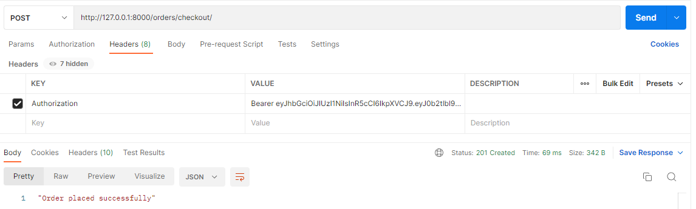

# Ecommerce API
> REST API to store and keep track of categories, products, user carts, orders/sales.  
  
API frontend: https://github.com/stealacamera/ecommerce-api-frontend

## API endpoints
<sup>*Uses JWT authentication.  
Methods in italic are only accessible by users.  
Methods in bold are only accessible by admins.*</sup>

### User endpoints 
`http://localhost:5000/api/account/`

| Endpoint  | HTTP methods | Description |
| --- | --- | --- |
| `register/` | `POST` |
| `change-password/` | *`PUT`* | Updates password & blacklists current refresh token |
| `change-address/` | *`PUT` `PATCH`* | Updates user address info (city, street address, zip code) |
| `token-refresh/` | `POST` |
| `login/` | *`POST`* | Enter username & password to log in |
| `logout/` | *`POST`* | Blacklists current refresh token |
| `profile/` | *`GET` `PUT`* | Get logged-in user's profile; Change username |
| `profile/<slug:username>/` | `GET` | Get the specified user's profile |

### Product endpoints
<sup>Filter products by category & rating.  
Order products by price & rating.  
Search through products by name & description.</sup>  
  
<sup>Filter reviews by rating.</sup>  
`http://localhost:5000/api/`

| Endpoint  | HTTP methods | Description |
| --- | --- | --- |
| `category/` | `GET` **`POST`** | Returns list of categories |
| `category/<pk>/` | `GET` **`PUT` `PATCH` `DELETE`** |
| ` ` | `GET` *`POST`* | Returns list of products |
| `<pk>/` | `GET` *`PUT` `PATCH` `DELETE`* |
| `<int:product_pk>/reviews/` | `GET` *`POST`* | Returns reviews for the specified product |
| `<int:product_pk>/reviews/<int:pk>/` | `GET` *`PUT` `PATCH` `DELETE`* |

### Cart endpoints
`http://localhost:5000/api/cart/`

| Endpoint  | HTTP methods | Description |
| --- | --- | --- |
| ` ` | *`GET`* | Returns user cart items |
| `<int:pk>/` | *`GET` `PUT` `PATCH` `DELETE`* |
| `add/<int:product_pk>/` | *`POST`* | Add specified product to user's cart |

### Order endpoints
<sup>Order sales & orders by date ordered.</sup>  
`http://localhost:5000/api/orders/`

| Endpoint  | HTTP methods | Description |
| --- | --- | --- |
| `checkout/` | *`POST`* | Turns cart items to orders, deleting the existing cart |
| `history/` | *`GET`* | Returns the user's placed orders |
| `sales/` | *`GET`* | Returns the user's sales/shop orders |
| `sales/<int:pk>/` | *`GET` `PUT` `PATCH`* |


## Usage
- **Register**


- **Change user password**


- **Change user address info**


- **Get categories**


- **Get products**


- **Create product**


- **Create review**


- **Add product to cart**


- **Get cart**


- **Checkout user cart**


- **Get user order history**


- **Get user sales**


## Installation
1. **Clone the repo**
```
git clone https://github.com/stealacamera/ecommerce-api.git
```
2. **Create and activate a virtual environment**
```
virtualenv <venv name>
<venv name>\Scripts\activate
```
3. **Install the dependencies**
```
pip install -r requirements.txt
```
4. **Run migrations and server**
```
python manage.py migrate
python manage.py runserver
```
